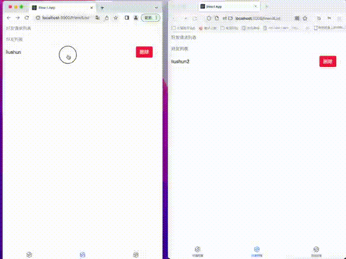
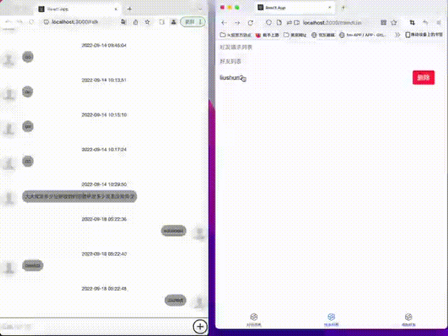

# 客户端技术
1. react
2. antdesign 组件库
3. socket.io
4. peer.js webrtc 库

# 完成功能

1. 登录
2. 搜索用户
3. 添加好友
4. 接受好友添加
5. 拒绝好友添加
6. 删除好友
7. 1 对 1 文字聊天
8. 1 对 1 视频聊天

# 客户端代码地址
https://github.com/Onedayago/chat
# 服务端代码地址
https://github.com/Onedayago/ChatServer

